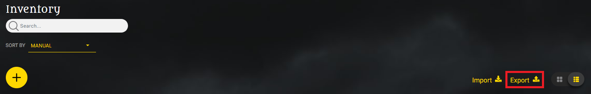
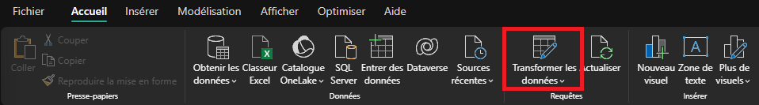
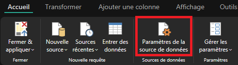
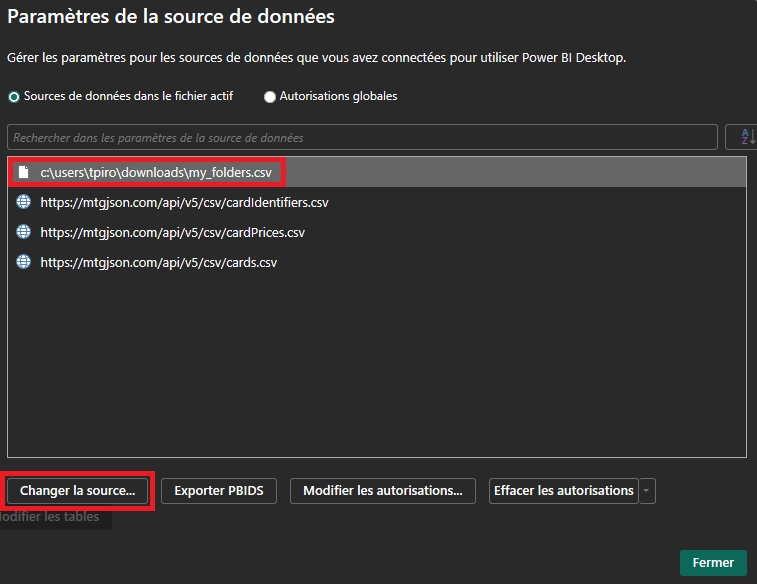
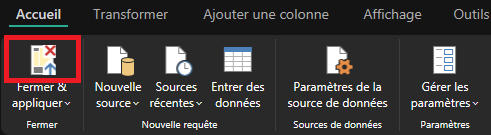
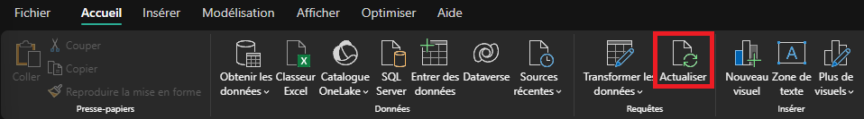

# User Manual

Team : Théo Pirouelle

---

## Installation / Pré-requis

- Installer Power BI depuis [Microsoft Store](https://apps.microsoft.com/detail/9ntxr16hnw1t?hl=en-us&gl=US)
- Télécharger les folders avec l'ensemble de vos cartes scannées depuis [MTG Scanner DragonShield](https://mtg.dragonshield.com/folders)

## Initialisation / Configuration

- Ouvrir le fichier
- Modifier la source de la table `my_folders`
  - Dans l'entête de Power BI, cliquer sur `Tranformer les données`
    
  - Dans l'entête de Power Query, cliquer sur `Paramètres de la source de données`
    
  - Sélectionner la table locale, puis cliquer sur `Changer la source...`, et laisser les paramètres par défaut
    
  - Valider et fermer le paramètrage des sources de données
  - Cliquer sur le haut du bouton `Fermer & appliquer`
    
  - Attender quelques instants que les données se mettent à jour
 
## Utilisation

- Au démarrage du fichier, il est recommandé d'actualiser les données :
  - Dans l'entête de Power BI, cliquer sur `Actualiser`
    
- Enjoy
